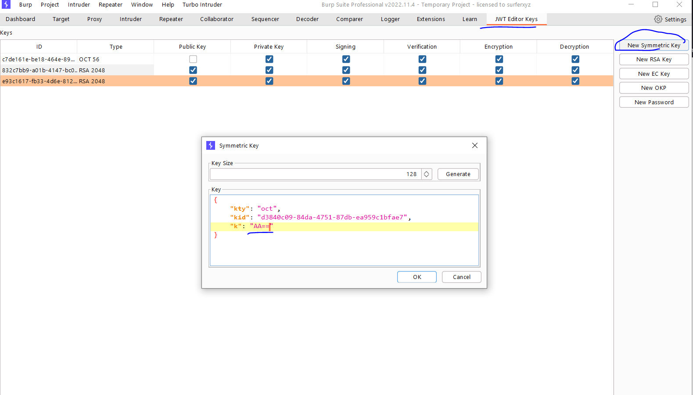
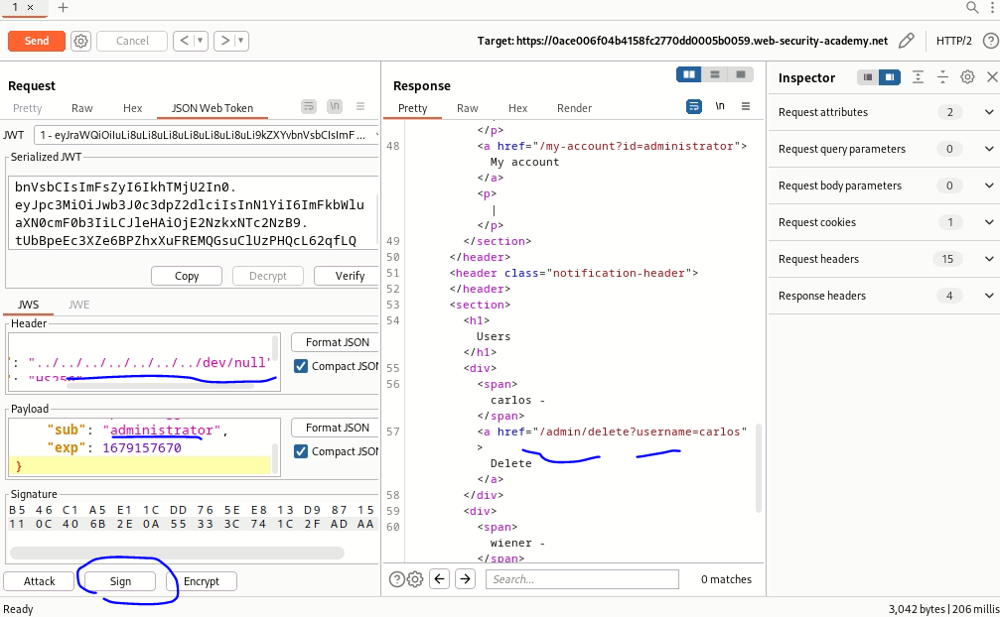
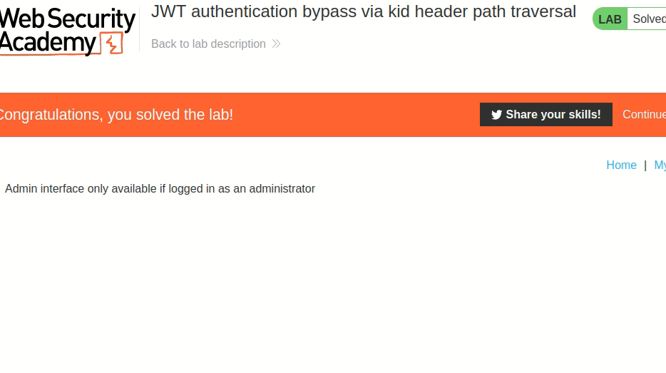

# Lab: JWT authentication bypass via kid header path traversal

**Link**: https://portswigger.net/web-security/jwt/lab-jwt-authentication-bypass-via-kid-header-path-traversal

**Solution**:

This lab uses `file system` according to kid (getting it as input from header) to get the signature of JWT.

To bypass it, we will use `null` byte file. And create a key with null secret.

So, the secret for null byte is `AA==` encoded base64

We will generate a key with this value and sign the request with it.

  

  

  

