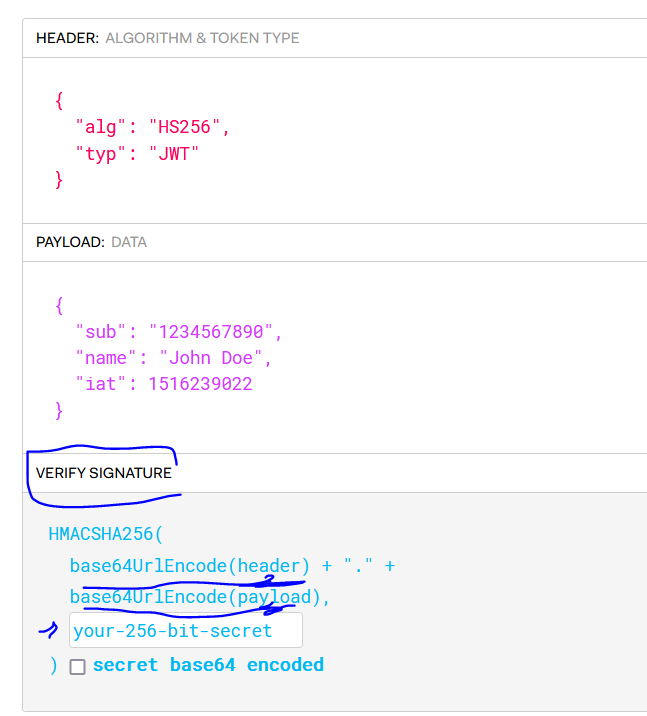
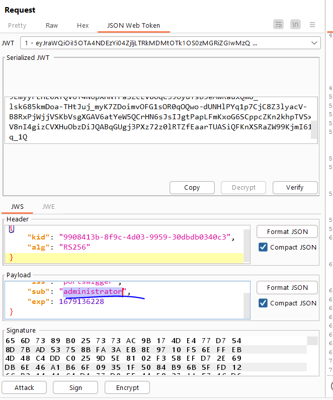
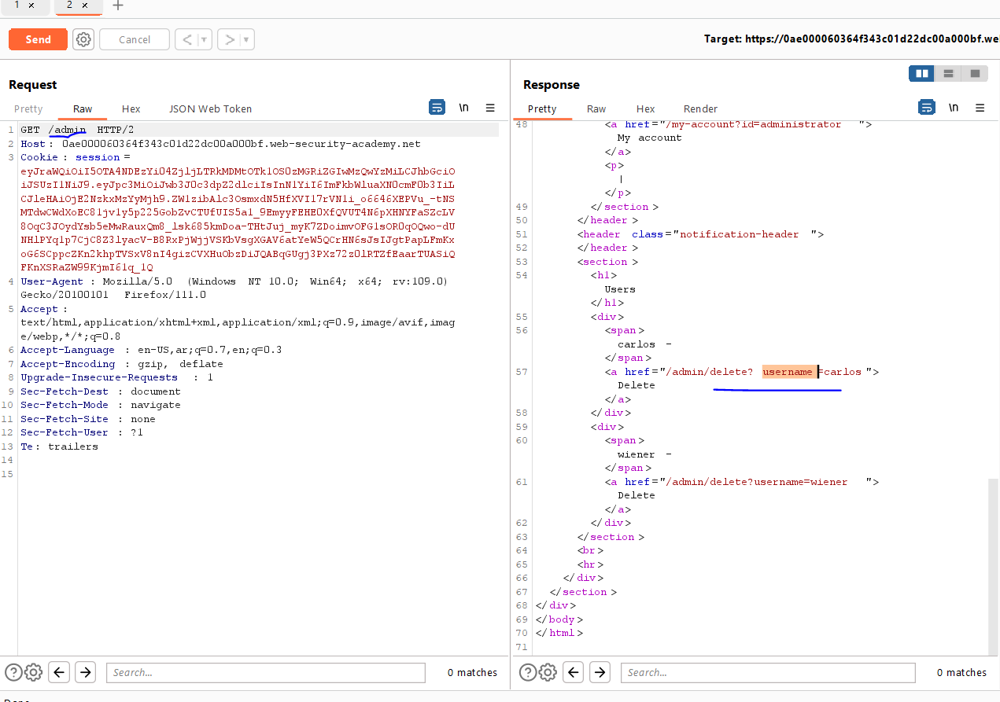

# Lab: JWT authentication bypass via unverified signature

**Link**: https://portswigger.net/web-security/jwt/lab-jwt-authentication-bypass-via-unverified-signature

**Solution**:

In this lab we will use burp extension called JWT editor.

- Highlight the requests that used JWT
- In the repeater, there is JWT token editor
  

  

This lab is not to verify the signature which consists of

  

So, if I change the username in the payload, it accept it and go admin panel.

  

  

  

