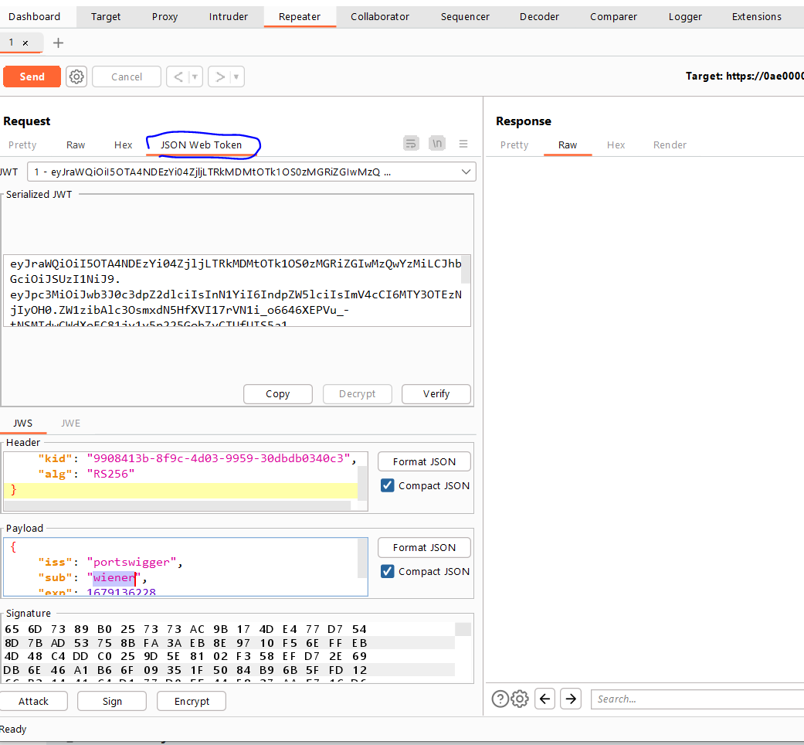

# Lab: Forced OAuth profile linking

**Link**: https://portswigger.net/web-security/oauth/lab-oauth-forced-oauth-profile-linking

**Solution**:

This lab contains a functionality for linking a social media account with GET request without CSRF token

<p align="center" width="100%">
  
</p>

<p align="center" width="100%">
  
</p>

So the redirecting oauth code can be used to link any user’s account to my own user

<p align="center" width="100%">
  
</p>

we will inject this code to iframe, so when the any user opened it, it will automatically to my own account.

1- Try Intercept the oauth-linking code 

2- copy it, because its unique per each oauth flow

3- drop the request

4- Go to the exploit server and Inject the following code

<p align="center" width="100%">
  
</p>

```html
<iframe src="https://0a9b0028046d74dfc06c22e700f300cb.web-security-academy.net/oauth-linking?code=ISS5TYMZAeJ74vPBA88NNPXIeO0LrEj-ngFaIhy2Skk"></iframe>
```

Once delivered to a victim, we will logout and login again with social media.

<p align="center" width="100%">
  
</p>
