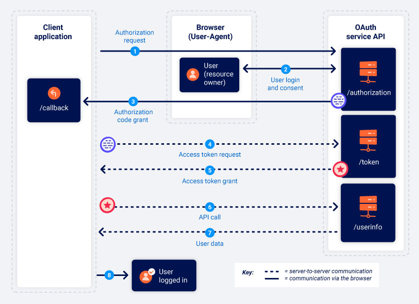
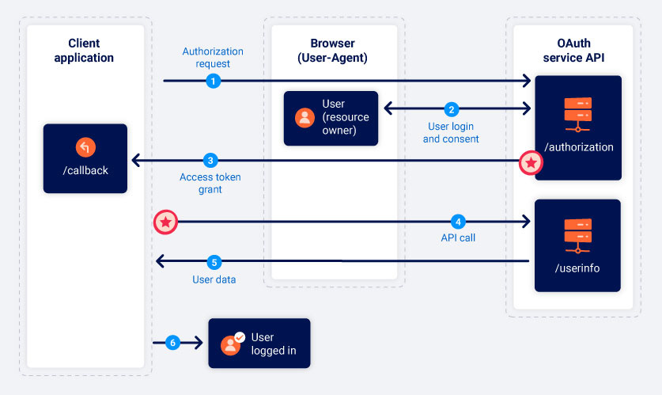

# OAuth2 

## Explanation

https://portswigger.net/web-security/oauth

https://portswigger.net/web-security/oauth/openid

https://portswigger.net/web-security/oauth/grant-types

[There are two Oauth mechanism](https://portswigger.net/web-security/oauth/grant-types) 

1- Authorization code 

  

- There another **`Authorization Code with PKCE`** which is improvement with more security checks

2- Implicit grant type (less secure)

  

## Labs
- [Lab Authentication bypass via OAuth implicit flow](https://github.com/aboelkassem/portswigger-labs/tree/main/OAuth2/Lab%20Authentication%20bypass%20via%20OAuth%20implicit%20flow)
- [Lab Forced OAuth profile linking](https://github.com/aboelkassem/portswigger-labs/tree/main/OAuth2/Lab%20Forced%20OAuth%20profile%20linking)
