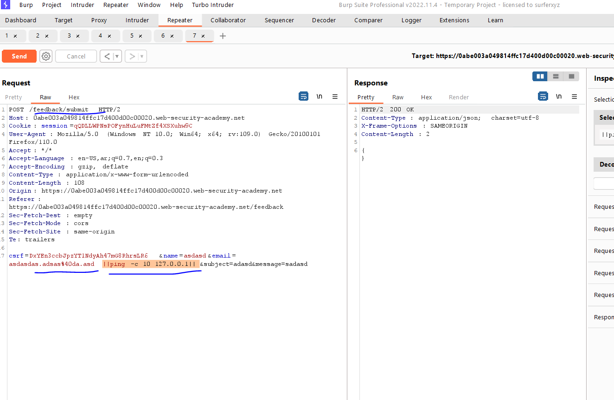

# Lab: OS command injection, simple case

**Link**: https://portswigger.net/web-security/os-command-injection/lab-simple

**Solution**:

In stock POST request, try cause an error by editing the request parameters 

If I added any special characters like the above, it gives us `sh` error (which is this is a OS command)

  

So, if we append another command with `|` will execute it

  

  

