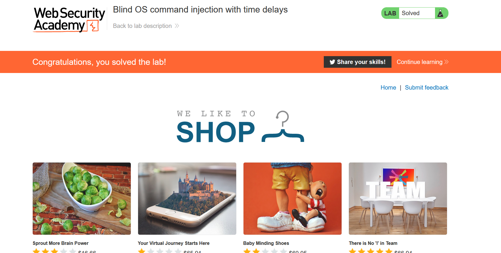

# Lab: Blind OS command injection with time delays

**Link**: https://portswigger.net/web-security/os-command-injection/lab-blind-time-delays

**Solution**:

This is the second type of the attack, which is not print any output but executed in the background.

To know if it executed or not, try add time delays and see its response

We can cause time delay by ping the localhost

In this lab, in feedback/submit function, we will add to `email` parameter OS command like the following

  

and encode it into URL-encoding.

You will notice that the response delays for 10 seconds.

  

