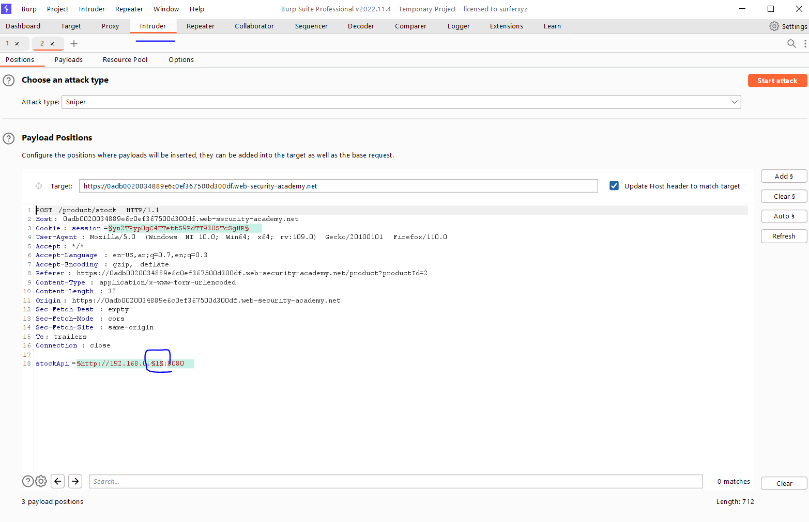
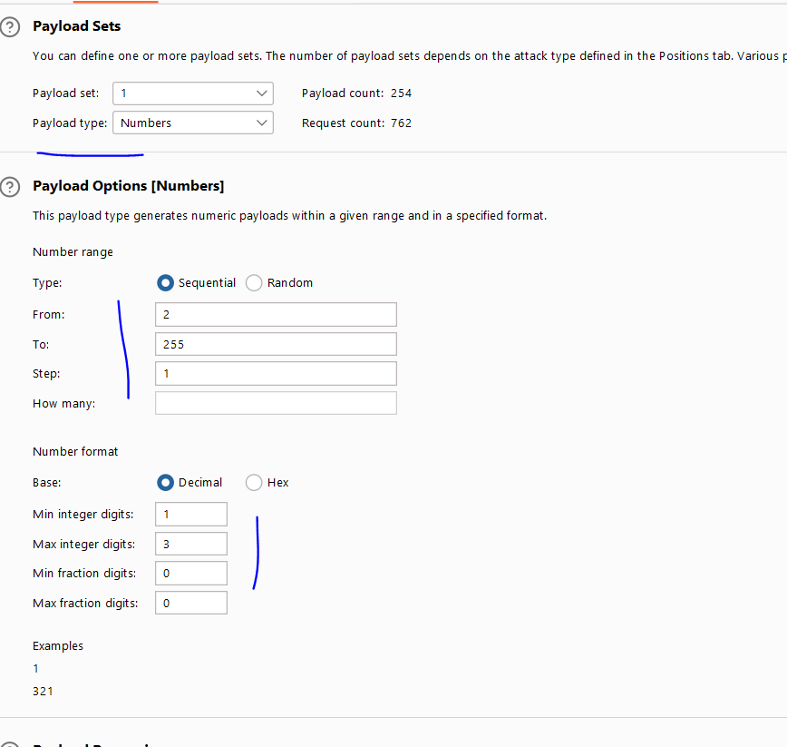
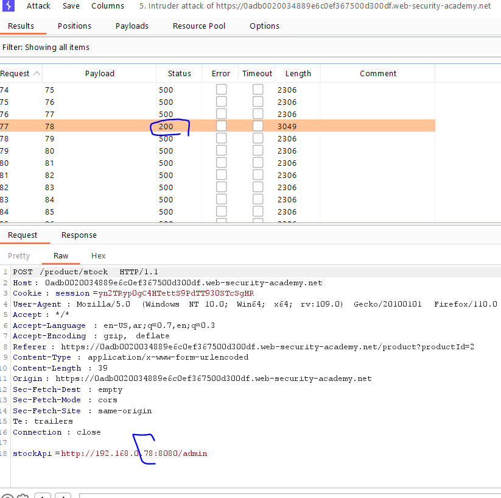
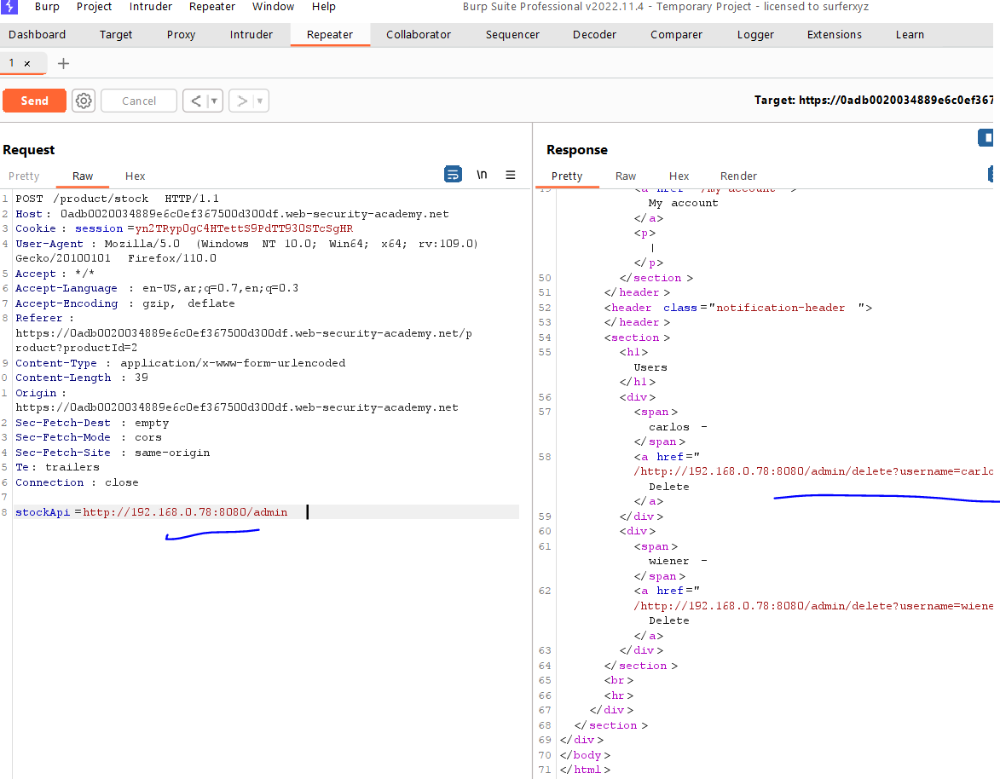

# Lab: Basic SSRF against the local server

**Link**: https://portswigger.net/web-security/ssrf/lab-basic-ssrf-against-localhost

**Solution**:

In the stock check (you will notice, the website is requesting another internal app to check the stock item) 

  

stockApi takes the URL of the internal app (only accessed throw the website not public to all users)

if we decode it stockAPI = http://stock.weliketoshop.net:8080/product/stock/check?productId=2&storeId=1

If we changed it to localhost, it will replay with the internal home page

  

so we can request anything

  

  

