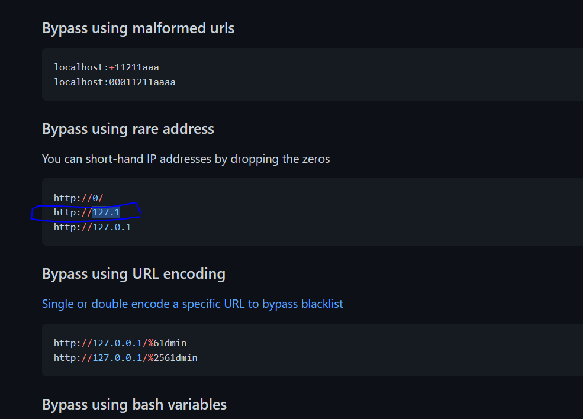
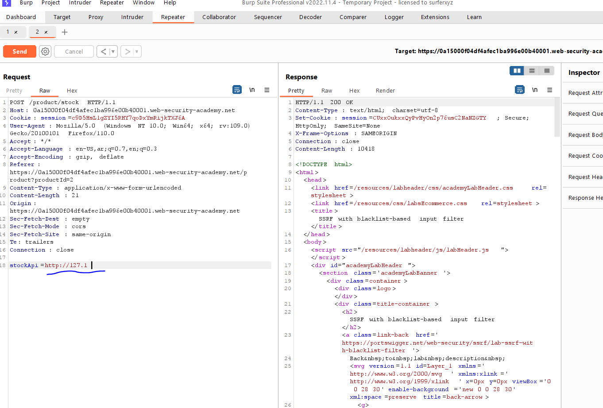
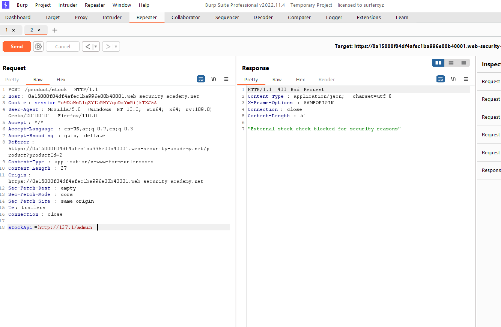
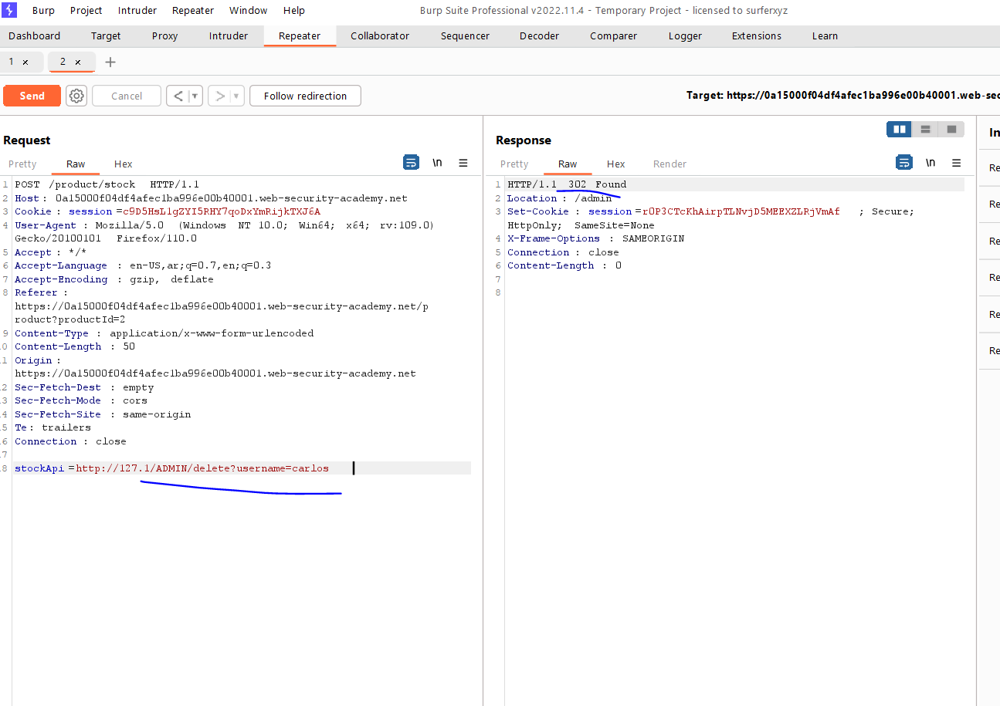
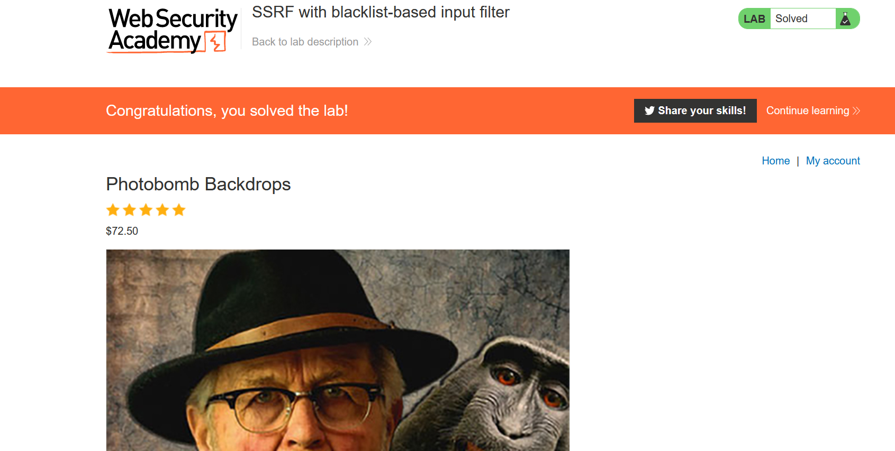

# Lab: SSRF with blacklist-based input filter

**Link**: https://portswigger.net/web-security/ssrf/lab-ssrf-with-blacklist-filter

**Solution**:

In this lab, the developer has blacklisted the [localhost](http://localhost) ips like

- http://localhost
- http://127.0.0.1
- http://::1

If we checked this payloads for different bypasses 

[https://github.com/swisskyrepo/PayloadsAllTheThings/tree/master/Server Side Request Forgery](https://github.com/swisskyrepo/PayloadsAllTheThings/tree/master/Server%20Side%20Request%20Forgery)

I have tried many [localhost](http://localhost) payloads from the above link but this is working form me

  

  

Is also blacklist `admin` keyword

  

so, if we changed it to `ADMIN` it will paybassed

  

  

