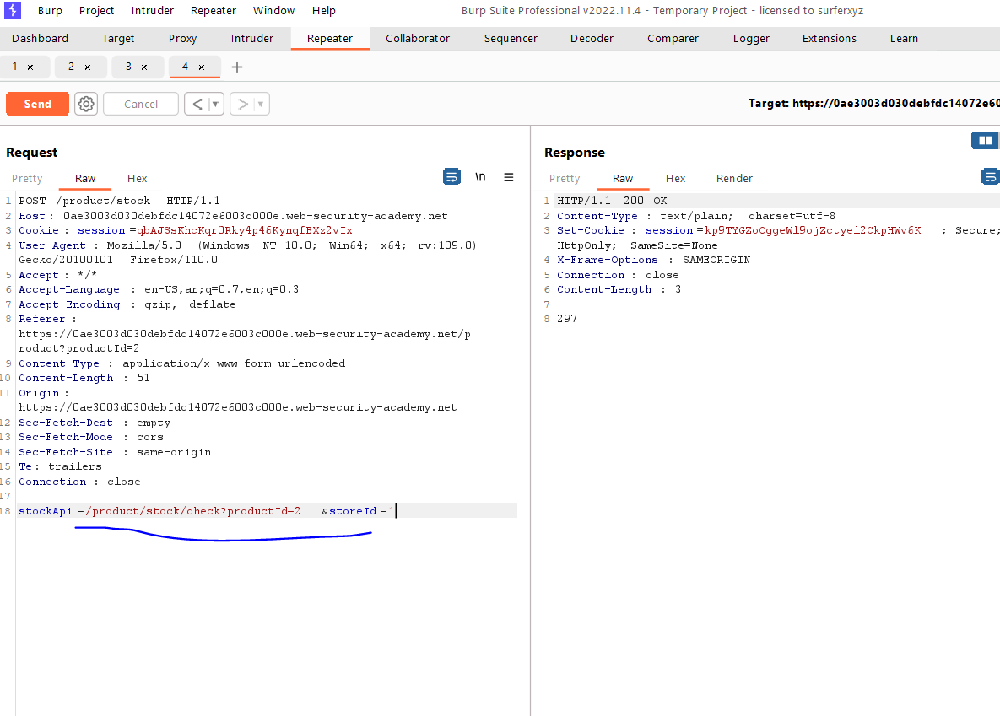
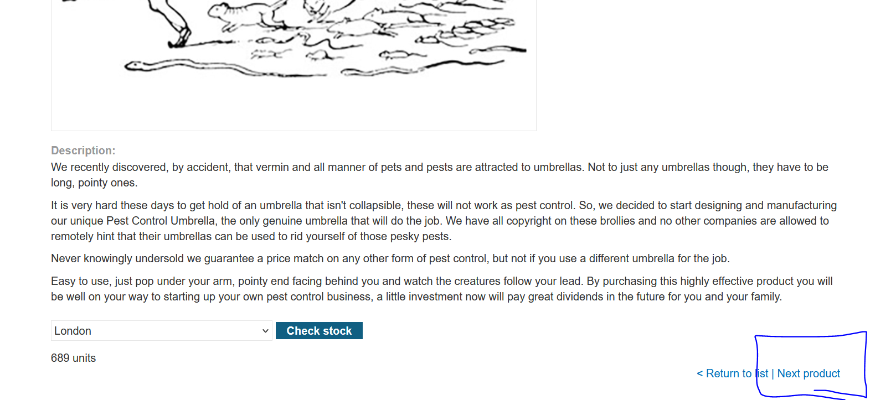
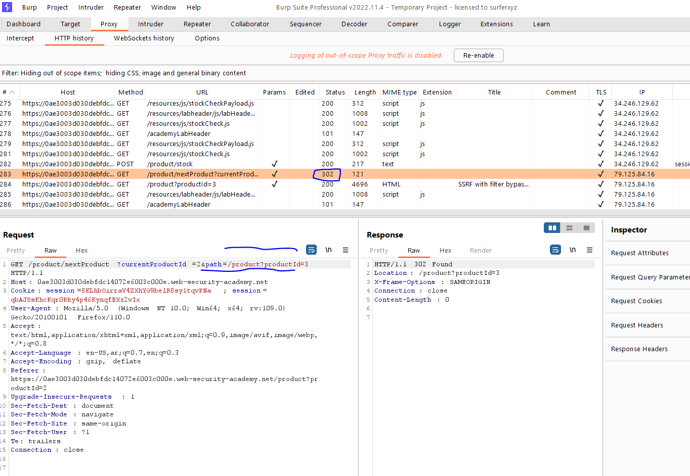
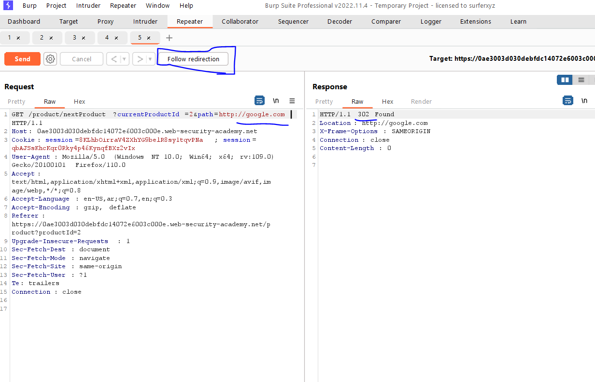
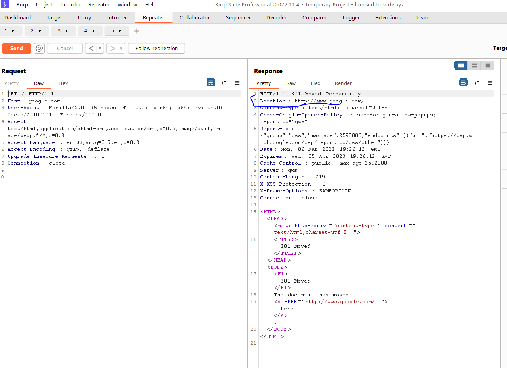
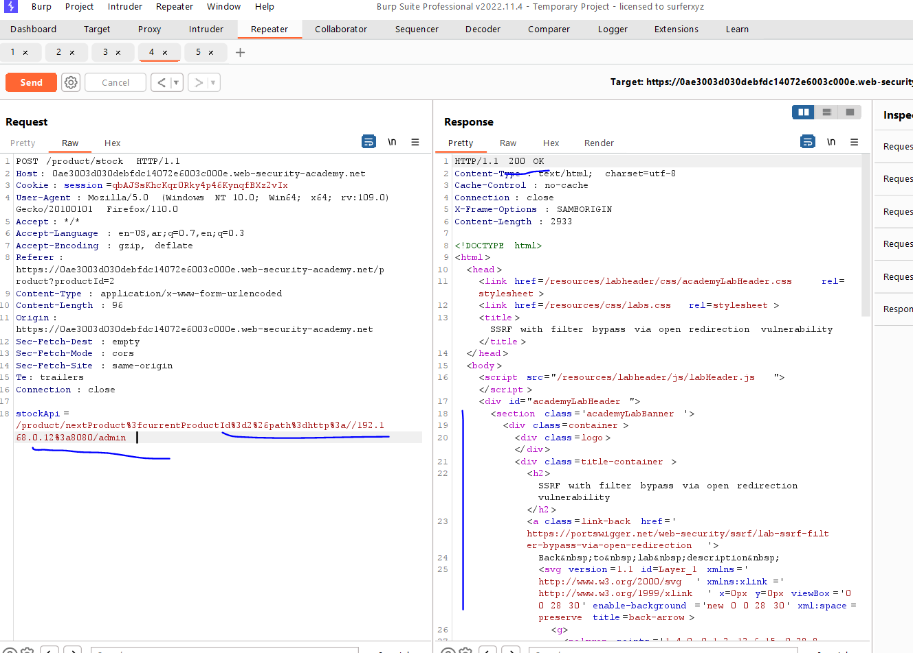
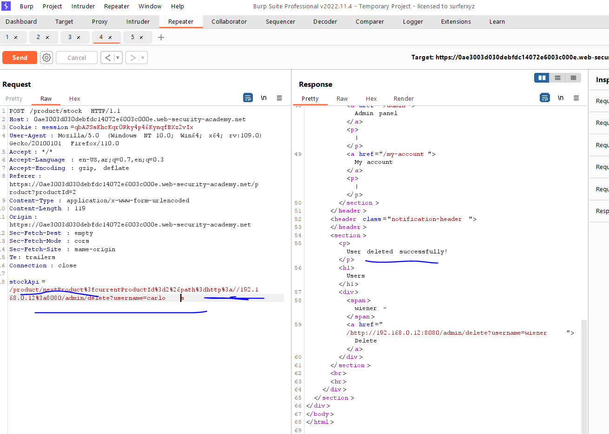
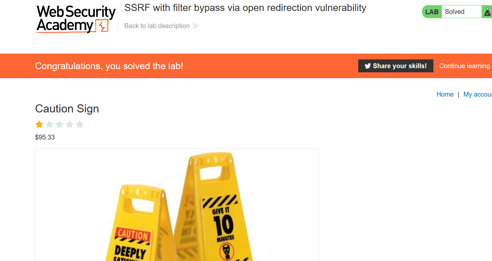

# Lab: SSRF with filter bypass via open redirection vulnerability

**Link**: https://portswigger.net/web-security/ssrf/lab-ssrf-filter-bypass-via-open-redirection

**Solution**:

Notice it takes a path `/product/stock/check?productId=2&storeId=1` then, the stock feature is only local feature in the app

  

And there is a lot of validations here

There is another button takes URL. and then redirect you to the given URL called `Next product`

  

  

  

When click on follow redirection,

  

So there is Open Redirection Vuln here,

we can make use of it, to give the SSRF url the full path of open redirection vuln

instead of 

- stockApi=/product/stock/check?productId=2&storeId=1

add the full redirect path of `Next Product` link

- stockApi=/product/nextProduct?currentProductId=2&path=http://google.com

If we encode it

  

  

  

