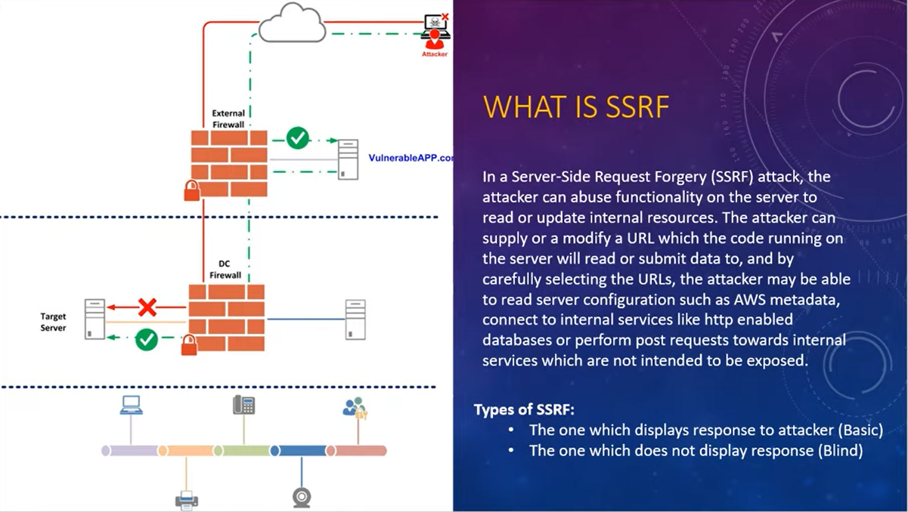

# SSRF

Try to send a request from public app to internal network app

  

## Labs
- [Lab Basic SSRF against the local server](https://github.com/aboelkassem/portswigger-labs/tree/main/SSRF/Lab%20Basic%20SSRF%20against%20the%20local%20server)
- [Lab Basic SSRF against another back-end system](https://github.com/aboelkassem/portswigger-labs/tree/main/SSRF/Lab%20Basic%20SSRF%20against%20another%20back-end%20system)
- [Lab SSRF with blacklist-based input filter](https://github.com/aboelkassem/portswigger-labs/tree/main/SSRF/Lab%20SSRF%20with%20blacklist-based%20input%20filter)
- [Lab SSRF with whitelist-based input filter](https://github.com/aboelkassem/portswigger-labs/tree/main/SSRF/Lab%20SSRF%20with%20whitelist-based%20input%20filter)
- [Lab SSRF with filter bypass via open redirection vulnerability](https://github.com/aboelkassem/portswigger-labs/tree/main/SSRF/Lab%20SSRF%20with%20filter%20bypass%20via%20open%20redirection%20vulnerability)
