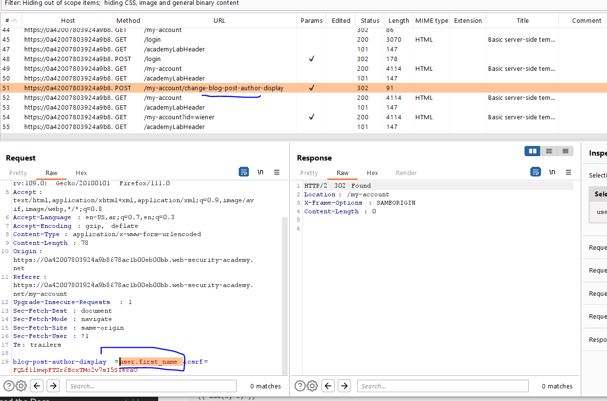
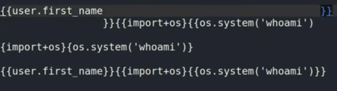
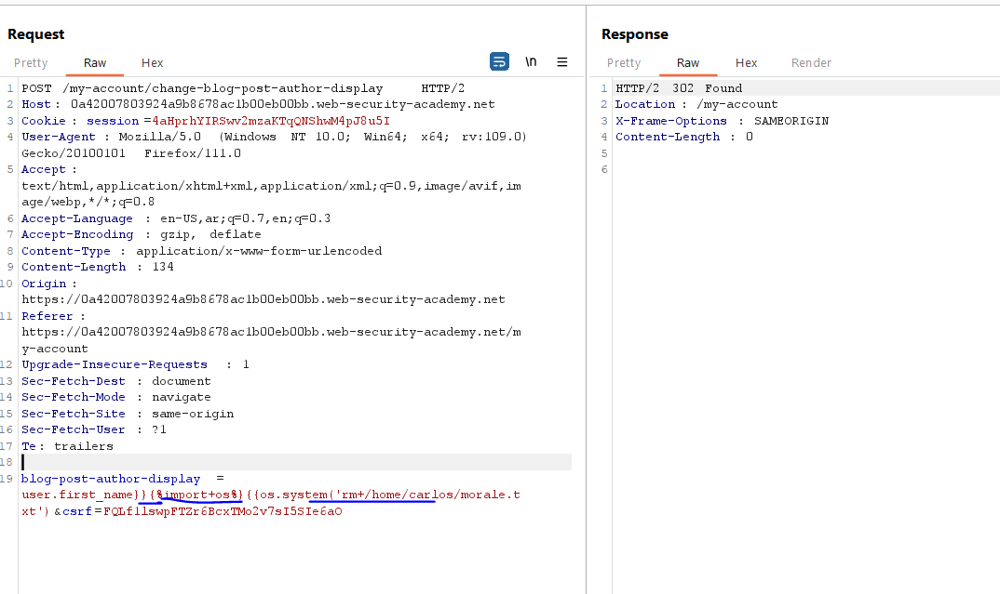
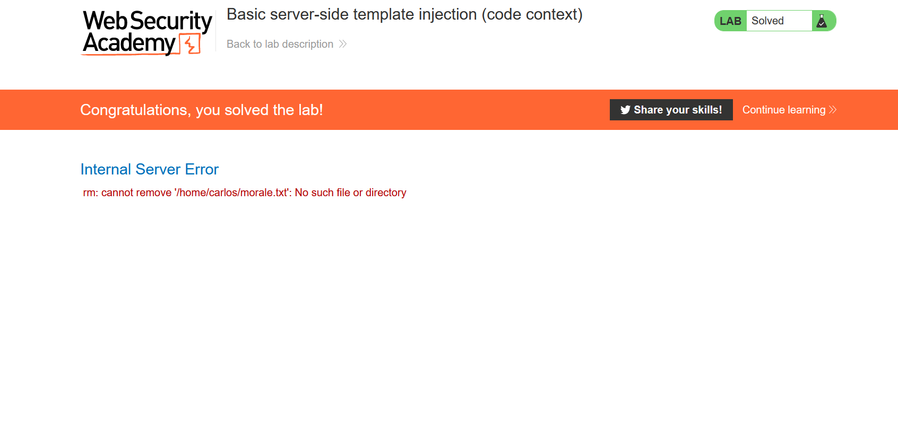

# Lab: Basic server-side template injection (code context)

**Link**: https://portswigger.net/web-security/server-side-template-injection/exploiting/lab-server-side-template-injection-basic-code-context

**Solution**:

This lab uses Tornodo template which depends on python

https://www.tornadoweb.org/en/stable/template.html

In account setting, there is preferred name which takes the user.first_name as a variable input like in the docs `like @{var test = 10} in c#`

```bash

  <li>{{ escape(student.name) }}</li>

```

<p align="center" width="100%">
  
</p>

<p align="center" width="100%">
  
</p>

we will craft a payload to inject OS command

1- according to the docs

its written in the code as ``{{ user.frist_name }}``

2- So, image to do another python code, we will close the brackets to be `user.first_name}}`

3- start new python code with  to be `user.first_name}}{os.system('ls')}`

4- to remove the file .txt, so the final payload will be `user.first_name}}{{os.system('rm+/home/carlos/morale.txt')`

<p align="center" width="100%">
  
</p>

To Solve the lab, we will change the command to delete file

`<%= system('rm /home/carlos/morale.txt') %>`

<p align="center" width="100%">
  
</p>

<p align="center" width="100%">
  
</p>
