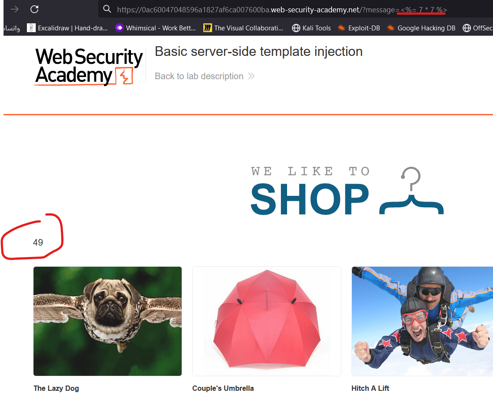

# Lab: HTTP request smuggling, confirming a CL.TE vulnerability via differential responses

**Link**: https://portswigger.net/web-security/request-smuggling/finding/lab-confirming-cl-te-via-differential-responses

**Solution**:

https://portswigger.net/web-security/request-smuggling/finding#confirming-http-request-smuggling-vulnerabilities-using-differential-responses

The solution here is to add any GET request that returns 404 and the server must understand it

  

  

