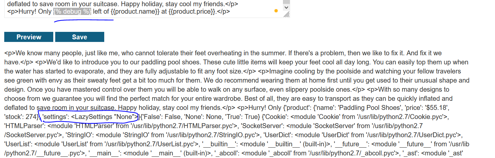
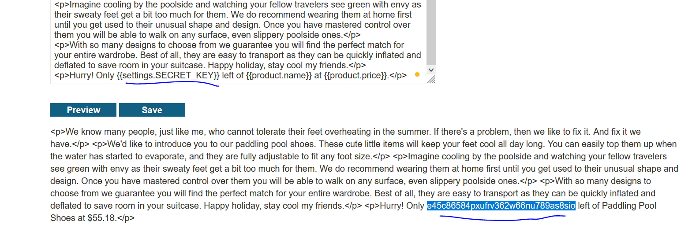
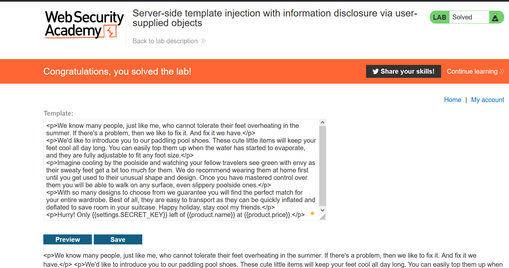

# Lab: Server-side template injection with information disclosure via user-supplied objects

**Link**: https://portswigger.net/web-security/server-side-template-injection/exploiting/lab-server-side-template-injection-with-information-disclosure-via-user-supplied-objects

**Solution**:

To identity the template of this lab, we will try causing an error

if we added `7*7` , we will see an error identifying that uses django framework.

if we see debug mode

  

there is settings object

according to the docs 

https://docs.djangoproject.com/en/4.1/ref/settings/#std-setting-SECRET_KEY

there is an attribute called SECRET_KEY which contains the secret key. If we trying to print it, we will see the following

  

  

