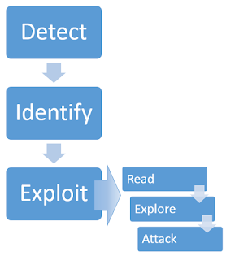

# Server-side template injection

## Explanation

https://portswigger.net/web-security/server-side-template-injection

SSTI: this vuln that the developer trust user input and put it into template like

```bash
Console.Writeline($"hello {name}")
```

`name` here is taken from the user as input.

We can test this vuln when passing an operation like 2*2

it will print `hello 4` 

The methodology to perform this attack


1- **Detect**

- try inject `${{<%[%'"}}%\` If an exception is raised, this indicates that the injected template syntax is potentially being interpreted by the server in some way

2- Identity

- Try identity which template it use by causing an error and read the documentation of it

3- Exploit

- Use [PayloadsAllTheThings](https://github.com/swisskyrepo/PayloadsAllTheThings) repo to identify which payload to use according to which template

  <p align="center" width="100%">
    
  </p>

## Labs
- [Lab Basic server-side template injection](https://github.com/aboelkassem/portswigger-labs/tree/main/Server-side%20template%20injection/Lab%20Basic%20server-side%20template%20injection)
- [Lab Basic server-side template injection (code context)](https://github.com/aboelkassem/portswigger-labs/tree/main/Server-side%20template%20injection/Lab%20Basic%20server-side%20template%20injection%20(code%20context))
- [Lab Server-side template injection using documentation](https://github.com/aboelkassem/portswigger-labs/tree/main/Server-side%20template%20injection/Lab%20Server-side%20template%20injection%20using%20documentation)
- [Lab: Server-side template injection in an unknown language with a documented exploit](https://github.com/aboelkassem/portswigger-labs/tree/main/Server-side%20template%20injection/Lab%20Server-side%20template%20injection%20in%20an%20unknown%20language%20with%20a%20documented%20exploit)
- [Lab: Server-side template injection with information disclosure via user-supplied objects](https://github.com/aboelkassem/portswigger-labs/tree/main/Server-side%20template%20injection/Lab%20Server-side%20template%20injection%20with%20information%20disclosure%20via%20user-supplied%20objects)
