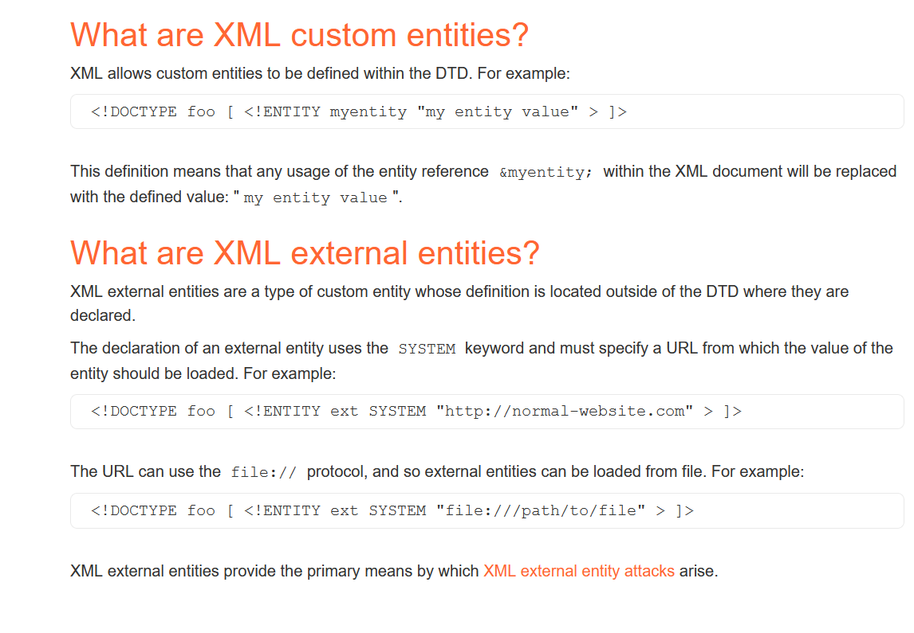

# XML external entity (XXE)

# Explaination

  

can be used in
- Any request that process XML (like SOAP services)
- Upload .xml file or svg

can be used to

- extract data, execute a remote request, or DDOS

https://portswigger.net/web-security/xxe
https://portswigger.net/web-security/xxe/xml-entities

### Types:
- In-band ⇒ display the results of execution
- Error ⇒ display the error and the results
- Out of band (blind xxe) ⇒ didn’t show results (show general error message), so you don’t know if it really executed or not

# Labs
- 
